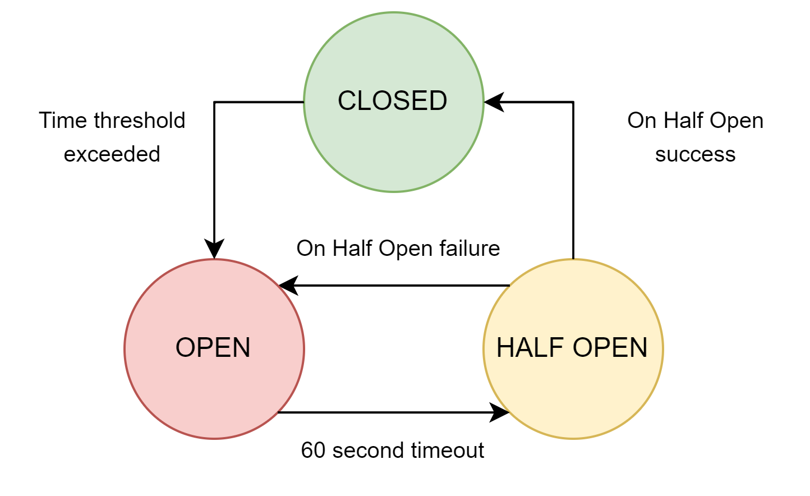

# DIT355 - Distributed Systems - Booking Backend Repository

 
 
## **Description** 
The component Booking Backend is a core part of DENS CURA, which is a distributed system with five parts. It is responsible for everything related to the actual booking of an appointment and connects it to the database. For a more detailed view of the DENS CURA system, please view the [Main repository](https://github.com/PatyMarklund/DIT355-Distributed-System-Main). 

*** 

 
 
 

## **Component responsibilities** 

* Handles bookings through the database by:
    * Checking if a specific time is available
    * Creates a booking
    * Finds a specific booking by ID 
    * Finds all the bookings in the database connected to a specific clinic and sends it to clinic backend.
    * Deletes a Booking
    * Updates a booking
* Preventing two or more persons to book the same timeslot with the same clinic through session handling
* Preventing an available booking to be blocked for users through session handling
* Preventing potential failures with circuit breaker

### Circuit Breaker

The book/save function is wrapped in a circuit breaker object. When failures reach a percentage of 50 %, the circuit breaker will enter the open state. The circuit breaker will stay in the open state for the duration of 60 seconds, during this time it basically does nothing, and therefore it is not possible to book any appointments. After 60 seconds the circuit breaker will enter the half open state and if the next call is successful it will go to the closed state. This means the system is functional again. However, if the next call in the half open state happens to be unsuccessful, the circuit breaker will go back in to the open state for another 60 seconds.

*** 

 
 

## **Installing and running** 

### Prerequisits:

**Node** 

* The following versions were used by our team during development, newer versions might also work: Windows v16.17.0 - Linux v12.22.9 - MacOS 14.20.0 - [Download](https://nodejs.org/en/download/) 

*** 
### Instructions:

| Step: | Instruction: |
| ------ | ------ |
| Clone this project on your machine | `git clone < SSH address or HTTPS address >` |
| Install necessary dependencies  | `npm i` |
| Start the system from the repo by running the following  | `npm start` |
 
 Make sure to also start the other systems since they are dependant on each other to work properly.
 

#
